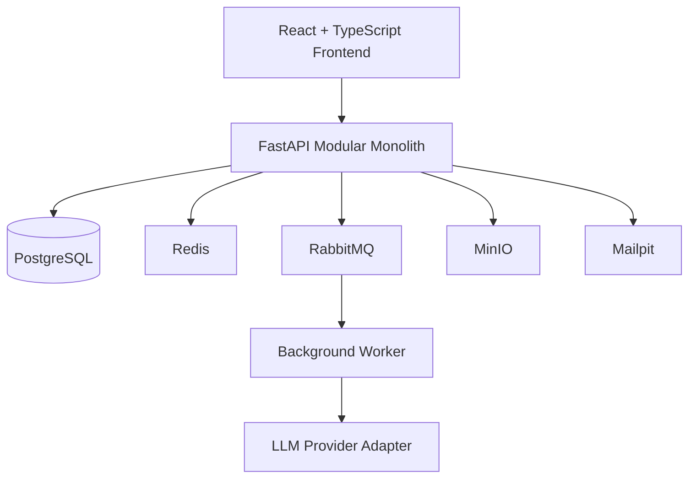

# Hiring Compass

An AI-assisted recruitment workspace that helps hiring teams move from an approved job description to approved candidate communication, with human control over every high-impact decision.

React · TypeScript · FastAPI · PostgreSQL · Docker

## The problem

Recruiters often coordinate job descriptions, resumes, interview feedback, approvals, and candidate communication across disconnected tools. This creates delays, inconsistent evaluation, weak visibility, and too much manual coordination.

## The solution

Hiring Compass provides one deliberate workflow:

```text
Create Job → Approve JD → Add Candidate and Resume → Review Evidence
→ Shortlist or Hold → Run Interviews → Collect Feedback
→ Generate Recommendation → Human Approves Decision
→ Draft, Approve, and Send Candidate Email
```

AI assists with analysis, recommendations, and drafts. It does not automatically hire, reject, or send candidate communication without human approval.

## Key capabilities

### Current foundation

- Docker-based development environment with PostgreSQL, Redis, RabbitMQ, MinIO, and Mailpit
- FastAPI with structured API responses, request IDs, and database readiness checks
- PostgreSQL connectivity and Alembic migration infrastructure
- Secure signup, login, refresh, logout, and current-user authentication
- Argon2 password hashing, short-lived access tokens, and rotating HTTP-only refresh tokens
- React application shell and responsive authentication experience
- Organization onboarding with backend-enforced `admin`, `recruiter`, `hiring_manager`, and `interviewer` roles
- Organization-aware dashboard shell, intentionally empty until hiring workflows are introduced

For development seed data, first change the seed credentials in `.env`, then run:

```bash
make seed-up
make seed-down CONFIRM=DELETE_SEED_DATA
```

`seed-up` creates or reuses one configured user, organization, and admin membership. `seed-down` removes only those records and refuses removal if either one is shared with other memberships.

### Planned recruitment workflow

- Organization and team role management
- Job and candidate management
- Resume storage and extraction
- Evidence-based screening
- Interview scorecards and feedback
- Approval workflow and audit timeline
- JD, screening, interview, decision, and communication agents

## Architecture



This is one monorepo with `frontend/` and `backend/`, built as a modular monolith rather than microservices. The backend follows Hexagonal Architecture (Ports and Adapters). AI is added only after the manual recruitment workflow is stable, with external providers behind adapters.

## Technology stack

| Area | Technology |
| --- | --- |
| Frontend | React, TypeScript, Vite, Tailwind CSS |
| Backend | FastAPI, Python, Pydantic |
| Persistence | PostgreSQL, SQLAlchemy, Alembic |
| Async services | Redis, RabbitMQ, Celery (planned worker) |
| Storage and email | MinIO, Mailpit |
| Security | JWT, Argon2 |
| AI (planned) | LangGraph, OpenAI/Ollama adapters |

## Development setup

```bash
git clone <repository-url>
cd hiring-compass
cp .env.example .env
make up
```

```bash
cd backend
uv sync
uv run alembic upgrade head
uv run uvicorn app.main:app --reload --host 0.0.0.0 --port 8000
```

```bash
cd frontend
npm install
npm run dev
```

| Service | URL |
| --- | --- |
| Frontend | `http://localhost:5173` |
| API docs | `http://localhost:8000/docs` |
| API health | `http://localhost:8000/health` |
| Database readiness | `http://localhost:8000/health/ready` |
| RabbitMQ management | `http://localhost:15672` |
| MinIO console | `http://localhost:9001` |
| Mailpit inbox | `http://localhost:8025` |

## Project status

Current milestone: Phase 1.7 complete — Dashboard Shell
Next milestone: Phase 2.1 — Jobs Domain

See the [API reference](docs/API.md) and [development roadmap](docs/DEVELOPMENT_ROADMAP.md) for implementation progress.

## Product principles

- Human approval for high-impact recruitment actions
- Evidence before recommendation
- Organization isolation and backend-enforced permissions
- Explainable AI outputs with uncertainty
- No duplicate candidate communication
- AI supports decisions; people make decisions
